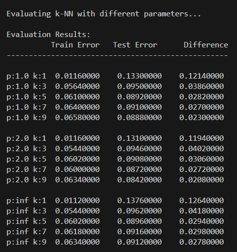
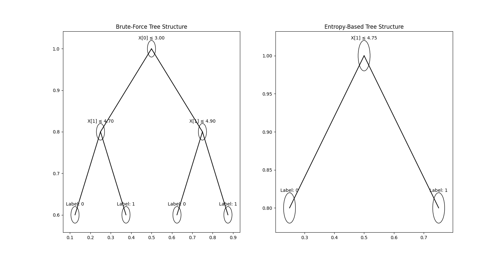
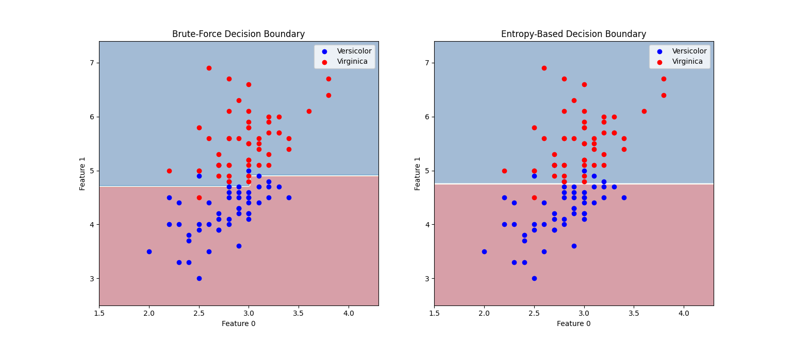

# Iris 🌸 Classification using Decision Trees and k-NN

A comprehensive machine learning project implementing and comparing Decision Trees and k-Nearest Neighbors (k-NN) algorithms for classifying Iris flowers. This project focuses on binary classification between Versicolor and Virginica species using their petal measurements.

## 📑 Table of Contents

- [Project Overview](#project-overview)
- [Key Features](#key-features)
- [📂 Project Structure](#project-structure)
- [Installation](#installation)
- [📊 Results and Analysis](#results-and-analysis)
  - [k-NN Performance Analysis](#k-nn-performance-analysis)
  - [Decision Tree Comparison](#decision-tree-comparison)
- [Usage](#usage)
- [🔬 Technical Details](#technical-details)
  - [Implemented Algorithms](#implemented-algorithms)
  - [Performance Metrics](#performance-metrics)
- [🤝 Contributing](#contributing)
- [📄 License](#license)

## Project Overview

This project implements and analyzes two fundamental machine learning algorithms:
1. k-Nearest Neighbors (k-NN) with various distance metrics
2. Decision Trees with two different splitting strategies (Brute-force and Binary Entropy)

The implementation uses the Iris dataset, specifically focusing on distinguishing between Versicolor and Virginica species using only their second and third features.

## Key Features

- **Advanced k-NN Implementation**:
  - Multiple k values (1, 3, 5, 7, 9)
  - Different distance metrics (L1, L2, L∞)
  - Comprehensive error analysis across parameters
  
- **Dual Decision Tree Approaches**:
  - Brute-force approach constructing all possible trees
  - Binary entropy-based splitting strategy
  - Visualizations of tree structures and decision boundaries

## 📂 Project Structure

```bash
.
├── models/                  # Core ML model implementations
│   ├── __init__.py
│   ├── decision_trees.py   # Decision tree algorithms
│   └── knn.py             # k-NN implementation
├── results/                # Generated visualizations
│   ├── decision_tree_errors.png
│   ├── decision_tree_figure1_visualization.png
│   ├── decision_tree_figure2_visualization.png
│   └── k-NN_errors.png
├── data_utils.py          # Data handling utilities
├── main.py               # Main execution script
├── metrics.py            # Evaluation metrics
└── visualization.py      # Visualization tools
```

## Installation

1. **Clone the repository**:
   ```bash
   git clone https://github.com/yourusername/iris-classification.git
   cd iris-classification
   ```

2. **Set up a virtual environment** (recommended):
   ```bash
   python -m venv venv
   source venv/bin/activate  # On Windows use: venv\Scripts\activate
   ```

3. **Install dependencies**:
   ```bash
   pip install -r requirements.txt
   ```

## 📊 Results and Analysis

### k-NN Performance Analysis

The k-NN implementation was tested with various parameters:
- k values: 1, 3, 5, 7, 9
- Distance metrics: L1 (Manhattan), L2 (Euclidean), L∞ (Chebyshev)

> 💡 **Key Findings**:
> - Higher k values generally resulted in more stable predictions
> - L2 distance metric showed slightly better performance
> - Best performance achieved with k=9 using L2 distance



### Decision Tree Comparison

Two decision tree implementations were compared:

1. **Brute-Force Approach** 🔍:
   - Error rate: 5.00%

2. **Entropy-Based Approach** 🎯:
   - Error rate: 7.00%




## Usage

Run the main analysis script:
```bash
python main.py
```

This will execute:
1. 📥 Load and preprocess the Iris dataset
2. 📊 Perform k-NN analysis with various parameters
3. 🌳 Generate decision trees using both approaches
4. 📈 Create visualizations and error analysis

## 🔬 Technical Details

### Implemented Algorithms

1. **k-Nearest Neighbors**:
   - Custom implementation with multiple distance metrics
   - Parameter evaluation framework
   - Cross-validation with 100 iterations

2. **Decision Trees**:
   - Brute-force tree construction
   - Entropy-based splitting
   - Visualization of tree structures and decision boundaries

### Performance Metrics

The project employs several metrics for evaluation:
- Classification error rates
- Training vs. Test set performance
- Error difference analysis

## 🤝 Contributing

We welcome contributions! Please feel free to submit a Pull Request. For major changes:
1. 🍴 Fork the repository.
2. 🌿 Create a new branch (`git checkout -b feature-branch`).
3. 💡 Commit your changes (`git commit -m 'Add new feature'`).
4. 📤 Push to the branch (`git push origin feature-branch`).
5. 🔍 Open a Pull Request.

## 📄 License

This project is licensed under the MIT License - see the LICENSE file for details.

