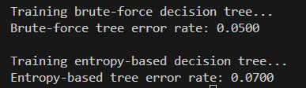

# Project Title

A brief description of your project, its purpose, and what it aims to achieve.

## Table of Contents

- [Introduction](#introduction)
- [Installation](#installation)
- [Usage](#usage)
- [Visualizations](#visualizations)
- [Contributing](#contributing)
- [License](#license)

## Introduction
In this ML project we analyze the Iris flowers dataset. we want to see how well does the kNN 


Provide a more detailed explanation of your project. Discuss the problem it solves, the methods used, and any relevant background information.

## Installation

Follow these steps to set up the project locally:

1. Clone the repository:
   ```bash
   git clone https://github.com/yourusername/yourproject.git
   cd yourproject
   ```

2. Create a virtual environment (optional but recommended):
   ```bash
   python -m venv venv
   source venv/bin/activate  # On Windows use `venv\Scripts\activate`
   ```

3. Install the required packages:
   ```bash
   pip install -r requirements.txt
   ```

## Usage

To run the code just write:
```bash
python main.py
```

## Visualizations

Here you can include visualizations of the results from running the two decision tree methods. 

### Decision Tree Results (Brute Force)


### Decision Tree Results (Binary Entropy)


Here you can see the error percentage we got from the kNN and the decision tree methods.

### kNN Errors


### Decision Tree Errors (Brute Force & Binary Entropy)



## Contributing

If you would like to contribute to this project, please follow these steps:

1. Fork the repository.
2. Create a new branch (`git checkout -b feature-branch`).
3. Make your changes and commit them (`git commit -m 'Add new feature'`).
4. Push to the branch (`git push origin feature-branch`).
5. Open a pull request.

